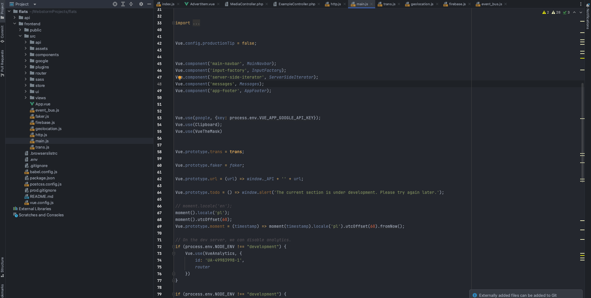

# colors

It contains Intelij color schema **One Dark Twilight**, being modification of Intelij **Twilight** that fits One Dark Theme

Use it with [One Dark Theme](https://plugins.jetbrains.com/plugin/11938-one-dark-theme/versions/stable)

### Example

